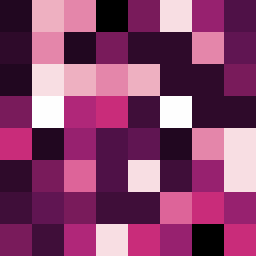

# shavis-go

A Go CLI tools that create a visualization of SHA256 or SHA1 hash sum, either directly, file or git commit hash
based on **[kernel137/shavis](https://github.com/kernel137/shavis)** built with **[cobra-cli](https://github.com/spf13/cobra)** and **[viper](https://github.com/spf13/viper)**.

<p align="center">A hash visualization of main.go</p>
<p align="center">
  
</p>

## Prerequisites

* Go compiler version 1.22.0 or higher

## Installation

1. Clone this repository

```sh
git clone https://github.com/StrixzIV/shavis-go.git
```

2. Build an executable file

**UNIX**

```sh
./build.sh
```

**Windows**

```sh
./build.bat
```

3. Add shavis-go directory to PATH

4. Copy `.shavis-go.yaml` and put it in home directory
   * **UNIX**: `~/`
   * **Windows**: `%userprofile%`
